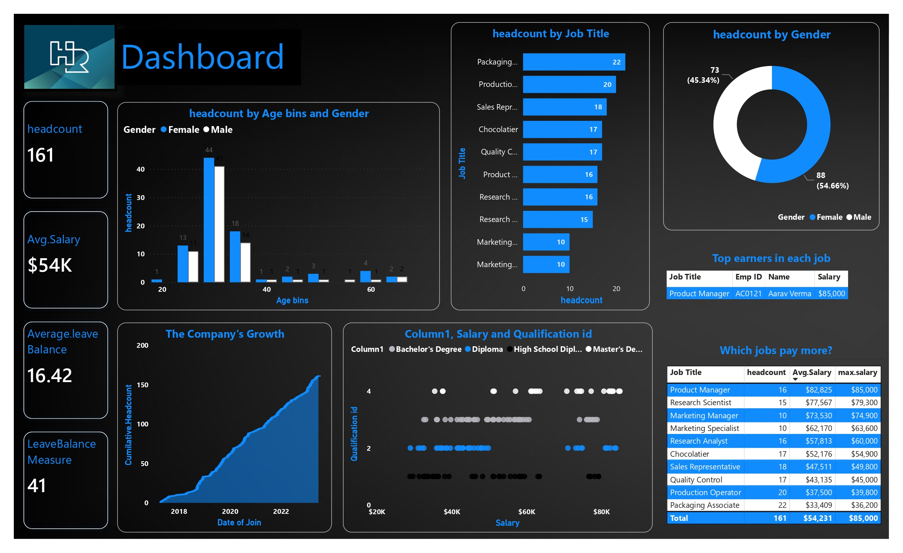

# HR Dashboard

Welcome to the HR Dashboard! This dashboard provides a comprehensive overview of various HR metrics within our organization. Below are the key features and insights available:

## Features

1. **Employee Count by Job**: Visualize the distribution of employees across different job roles.

2. **Gender Breakdown**: Analyze the gender distribution among our staff members.

3. **Age Distribution**: Explore the age spread of our workforce, helping identify demographic trends.

4. **Salary Comparison by Job**: Compare the salary levels across various job roles to identify positions that offer higher compensation.

5. **Top Earners**: Identify the top earners within each job role to recognize high-performing employees.

6. **Qualification vs. Salary**: Analyze the relationship between employees' qualifications and their respective salaries.

7. **Staff Growth Trend**: Track the growth of our workforce over time to understand our organization's expansion or contraction trends.

8. **Employee Filter**: Easily filter employees by the starting letter of their names for quick access.

9. **Leave Balance Analysis**: Monitor employees' leave balances and trends to ensure effective leave management.

10. **Quick HR Dashboard**: Access a concise overview of key HR metrics for quick reference.

## Instructions

1. Navigate to the respective sections or dashboards using the menu options provided.
2. Use interactive filters and controls to customize data views according to your requirements.
3. Utilize tooltips or help icons for assistance in interpreting visualizations.
4. For any technical issues or inquiries, contact the HR dashboard administrator.

Thank you for using our HR Dashboard to gain valuable insights into our workforce!

*For further assistance, please refer to the documentation or contact [HR Dashboard Administrator](mailto:admin@example.com).*
